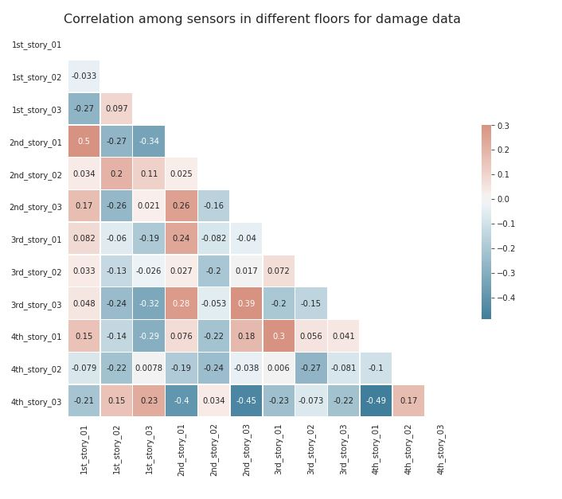

# 3. Exploratory Data Analysis

The goal of this EDA is to identify characteristics between damage and undamaged conditions in order to perform data preparation and develop a model in the future steps.

## 3.1 Preparing the data

<em>Figure 3.1: Checking if the data is sorted logically as undamaged becoming damaged.</em>

As the dataset shows, we have damage within our data. Therefore, Case 1 is not represented in train data.

<em>Figure 3.2: Analyzing the training data provided.</em>

The reason that there are accelerations values at the first row is because researchers started measuring the structure's response once it reached steady state. More details regarding the dynamic behavior of this structure will be discussed in the following sections.

**Separating train data into damage and undamage dataset**

<em>Figure 3.3: Missing data in the undamaged section.</em>

*As shown above, the given data set contained a large quantity of NA data values which are all located in the undamaged portion.*

Between populating or removing the missing data, the missing results will be dropped. The reason for this decision is because populating the missing values with the mean of the training data will mostly develop a new dataset that does not have all the original parameters. 

**Aesthetic modification for easier comprehension of the training data**

The provided training dataframe had columns names such as DA04, which corresponds to the sensor located in the first floor west side. Instead of keeping these columns names, the datasets were named as shown below.

<em>Figure 3.4: Column Names.</em>

**Units**

Based on *Experimental Phase II of the Structural Health Monitoring Benchmark Problem* , accelerometers were placed throughout the structure to provide measurements of the structural response. For this Exploratory Data Analysis, three sensors from each floor of the 4-story structure were taken into consideration. Specifically,

Sensor 01 = Sensor located at the west side of the structure. 

Sensor 02 = Sensor located at the center of the structure.

Sensor 03 = Sensor located at the east side of the structure.

$Units = \frac{m}{s^2}$ 

- In the original data from the researchers, time is described as,
$Time(seconds) = \frac{1 : Length_{DA04}}{fs_{days}}$ 

where fs_days = 200 (Hz).

Therefore, the final step on the tidying portion of the exploratory data analysis was to transform the "Time" column into seconds by divided by 200.

## 3.2 Statistical Properties

We can learn certain details of the response of the structure by observing the data points that have a very drastic change in amplitude. In other words, there are common points in time among all sensors where the acceleration measured does a 180 degree change. This phenomenon occurs as the dynamics response of structure is harmonic and it develops nodes. A simplification of this idea is to understand how the sensors in the 4th story will move back and forward while the nodes underneath are ahead or behind that displacement.

<em>Figure 3.5: Visualization of the overall data.</em>

The mean for all the sensors is very close to 0, which may indicate normalized normal distribution. Also, the standard deviation is not equal to 1 for any of the sensors, but a close value to 0 too. These characteristics are present for normal distributions of narrow dispersion.

In the case of undamaged dataset, the standard deviation values of the fourth floor are the largest among all floors. This indicates a flexibility in the structure as the dynamic response took place. Another very interesting fact that we can learn from the previous tables is how the maximum value of 0.01 takes place at two sensors in the 4 story, and the sensor located at the center for the 1st and 2nd floor. The absence of this value at the 3rd floor may indicate an anomaly. This value stays constant after the structure is considered damaged for the sensors located at the center of the second and fourth floor.

**Checking head, tail of data**

<em>Figure 3.6: Histogram of undamaged acceleration values at each sensor</em>

In the case of the undamaged dataset, all the graphs show normal distribution. However, they are not centered with an exact mean of value 0. Instead,

- Sensors located at the west side of the structure are skewed to the right in the first and fourth floor while the second and third floor are skewed to the left.
- Sensors located at the center of the structure behave symmetrically. The first and third floor have bell-shaped distribution with a mean of 0. The second and fourth floor are lightly skewed in opposite directions.
- Sensors located at the east side of the structure are all skewed except the one located at the second floor. The sensor at the 4th floor captured the most out of plane behavior as the '4th_story_03' sensor is significantly skewed to the left.

<em>Figure 3.7: Histogram of damaged acceleration values at each sensor.</em>

    
    
For the case of damage condition, the normal distribution is not as smooth as shown for the undamaged condition. This behavior matches with the physical phenomenon that took place as the acceleration of the sensors will tend to be more extreme if the structure is damaged. 

- The first floor endured the most extreme values as the base is not static anymore during excitation. The three sensors are skewed to the right.
- The second and third floor has similar behavior since the center sensor is still normally distributed with mean very close to 0 and sensors on the west and east side are skewed to the left.
- The fourth floor now shows the most centered behavior. However, it is important to recall the statistical characteristics such as standard deviation. Now the 4th-floor values are significantly wider.

## 3.3 Exploring the dataframe that contains the undamaged condition

Previously, we explored some characteristics of the undamaged dataset. Then, the dataset has been arranged and tidied to finally observe how there was a large among of non-available data points, which can be observed in the last row (index number > time_sec)

**Is the change in acceleration always the same?**

For the following inspection, recall that data acquisition was started several seconds after the excitation was turned on to ensure that the system had reached a steady state condition during the shaker testing.

<em>Figure 3.8: Changes in acceleration during the undamaged condition for the first and second floor.</em>

<em>Figure 3.9: Changes in acceleration during the undamaged condition for the third and fourth.</em>

Interestingly, the analysis has shown how the location of the sensor affects directly to the change in acceleration of the sensors. The y-axis has been kept constant throughout all the plots to ease comparison. Therefore, we can observe how though the distribution among sensors in different floor is different, the difference in acceleration values is very correlated to location.

Also note how the missing data produced zero values in the left portion of the data. Those values are not representing a constant acceleration.

**Correlation values**

<em>Figure 3.10: Correlation values among all sensors in the undamaged condition.</em>

    

The table above is with the purpose of locating the directly correlated and inversely correlated sensors. Just as the difference in acceleration graphs showed, there is significant correlation between those sensors that are located in the same side of the structure. 

However, there is an inverse correlation in those sensors located at the fourth floor. The reason behind this behavior is that we are analyzing an elastic structure that is being excited by an harmonic input from the ground. Therefore, the top floor is swinging, which creates a driving behavior in one of the corners at a time.

## 3.4 Exploring the dataframe that contains the undamaged condition

**Is the change in acceleration always the same?**

<em>Figure 3.11: Change in acceleration between sensors in the damaged condition for the 1st and 2nd floor.</em>

<em>Figure 3.12: Change in acceleration between sensors in the damaged condition for the 3rd and 4th floor.</em>

There are certain conditions that we can observe by comparing the undamaged and damaged conditions. First of all, there is still a correlation in the change in acceleration with the location of the sensors. Also, the delta value has been significantly decreased over the length of the response. The largest change in acceleration is located at the center sensors for this particular condition, which might mean that the structure is not displacing as much once it reaches a damaged condition.

**Correlation values**

<em>Figure 3.13: Correlation value among all sensors for the damaged condition.</em>

In this scenario, the correlation has changed greatly. Now, the 4th-story sensors display similarities with other sensors placed in the same side of the structure. However, the 3rd-story sensors are those that are inversely correlated. 

## 3.5 Conclusion

The training data obtained has been statistically explored, cleaned, and analyzed for the purpose of identifying parameters for modeling later on.

- Missing data has been removed.
- Datatype and Data Info has been discussed and visually listed.
- The distribution for the undamaged and damaged conditions proved to be normally distributed with skewness at different direction based on the sensors. This analysis portion showed how the skewness was correlated with the behavior that was taking place during excitation as the dynamic response of a steel frame structure is not rigid. Also, once the damaged condition was achieved, the distribution showed a larger standard deviation.
- The individual analysis of each condition proved to be succesful in correlating the behavior of each sensor among stories. 
    - The change in acceleration depended directly with the location on the sensor within the steel frame structure. 
    - There was a high correlation between sensors located at different floors that were place on the same side.    
- Due to the high symmetry among all the results and comparisons, it is probable that the training data belonged to Case 6, Case 7 or Case 8. However, the final information indicated how the 3rd story behaved differently, which potentially indicated that the training data has a higher probably of being Case 8.

