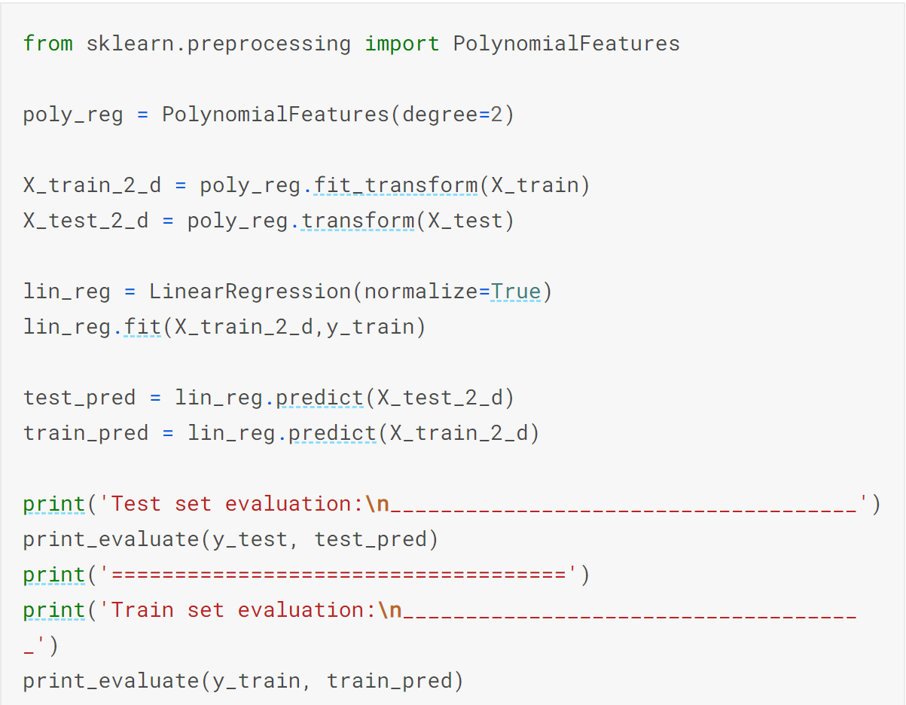
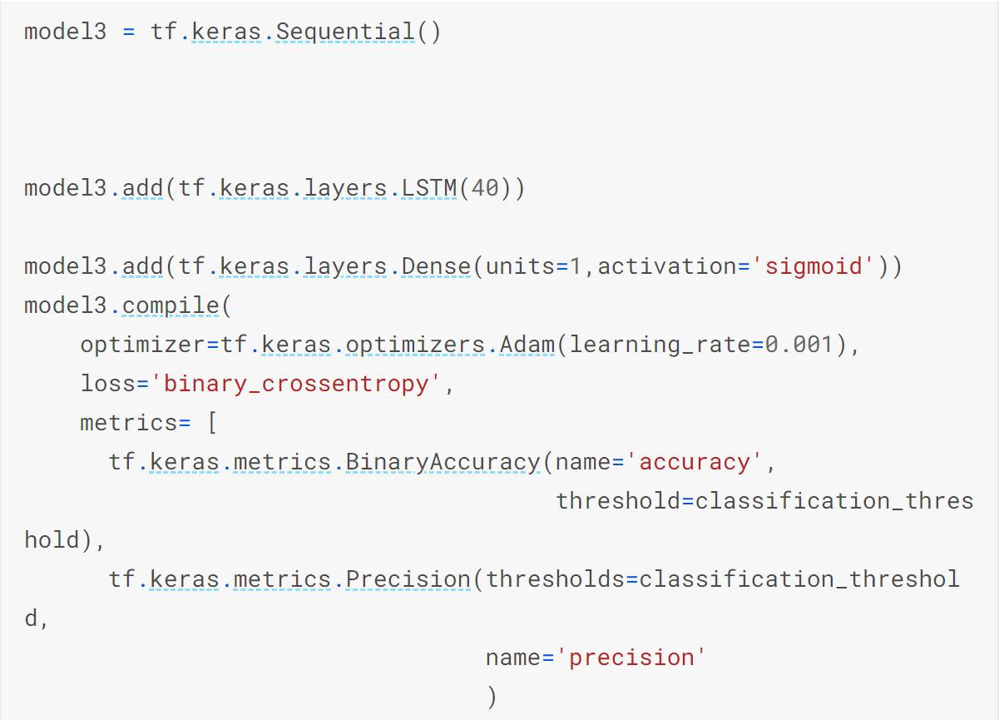

## 4. Machine Learning Methods

## Overview
Following a comprehensive exploratory data analysis as outlined in the previous section, which was valuable in looking at different patterns and features of the data obtained from various sensors. The next task then, was to classify this data as either damaged or undamaged. Classification problems are very common in the data mining and machine learning applications. As such, several machine learning algorithms have been proposed and developed over the years for solving such problems. For our project, we have evaluated and tested five of those algorithms namely, Logistic regression, polynomial regression, artificial neural networks, recurrent neural networks and random forests.

## 4.1 Explanation of the Problem:
Our Kaggle Project was focused on Binary classification. Binary Classification is the task of classifying the elements of a set into two groups on the basis of a classification rule. Our problem revolved around classifying the structural damage detected in a structure. We had to choose different machine learning algorithms to help classify the data.

## 4.2 Steps For each algorithm:
First we had to create a model, softmax or sigmoid used in output layer, so that we could train the model and tune hyperparameters, such as accuracy, precision etc. Finally, we had to test the performance of model against the sample data. This allowed us to compare results from different models and see what model was the most accurate at classifying the data.

## 4.3 Data Preparation:
First we had to split the train dataset into 2, one set for training and the other for validation. Then we had to shuffle the train dataset before using it. We then used regularizations to apply penalties on layer parameters or layer activity during optimization. Dropouts were used to incorporate non-linearity. The data was normalized by subtracting the mean and dividing by standard deviation.

## 4.4 Method 1: Logistic Regression:
Logistic regression is a technique commonly typically used for predicting binary classes but can also be used for multi-class problems and is adopted from the field of statistics. It describes and estimates the relationship between one dependent variable and the independent variables. Logistic regression is a special case of linear regression that produces a constant output which is categorical in nature. Thus it is based on the linear regression equation:

<em>Figure 4.1: Logistic Regression (Sigmoid Activation Function)</em>

### 4.4.1 Justification for Logistic Regression:

The (sometimes surprising) observation is that this is still a linear model. Logistic regression is one of the most simple machine learning algorithms that can be used for binary classification problems. It is easy to implement and can be used as a baseline for any binary classification problem. As such, we decided to use it as a baseline to which all the other models will be compared with. It can also be built upon for developing more complex machine learning algorithms for deep learning. It computes a probability output and in order to map this output to a binary category we needed to define a classification threshold (also known as the decision threshold). However, a linear regression does not necessarily yield an output between 0 and 1. Therefore, to ensure the output probability is always between 0 and 1 we used a sigmoid activation function in the output layer. Different combinations of hyperparameters were tested for this algorithm, however to save computation time an epoch value of 20 was used with a learning rate of 0.001. A classification threshold of 0.2 was also found to work best for the given dataset. Although logistic regression is sensitive to outliers and multicorrelation between the features, our exploratory data analysis showed we do not have this problem for our given dataset. Therefore, we expect to achieve reasonable results using this method.

<em>Figure 4.2: Overview of Logistic Regression Model</em>
  
## 4.5 Method 2: Polynomial Regression:

One common pattern within machine learning is to use linear models trained on nonlinear functions of the data. This approach maintains the generally fast performance of linear methods, while allowing them to fit a much wider range of data.

For example, a simple linear regression can be extended by constructing polynomial features from the coefficients. In the standard linear regression case, the model is based on the expression previously shown above. If we want to fit a paraboloid to the data instead of a plane, we can combine the features in second-order polynomials, so that the model looks like this:

del: to see this, imagine creating a new variable
 

 
With this re-labeling of the data, our problem can be written as:
 

 
### 4.5.1 Justification for Polynomial Regression:
 
Sometimes the relationship between the dependent and independent variables maybe non-linear. As in this case, we do not expect a linear relationship between the features and the target variable, it made sense to try a non-linear algorithm. The simplest and most common non-linear method to use is the polynomial regression as described earlier. Intuitively, we would expect a regression model with higher orders to perform better than a simple one. However, we didn't find significant improvements between 2nd degree and higher order polynomials. Therefore, for this project we chose to use 2nd degree polynomial regression models to help save computation time.
 
 
 

<em>Figure 4.3: Overview of Polynomial Regression Model</em>
 
## 4.6 Method 3: Artificial Neural Networks:
The second method utilized was Artificial Neural Networks. Artificial Neural Networks are more complex than logistic regression. This method adds a bunch of hidden non-linear layers to the logistic regression model. Our group used this method to check if it offered an improvement on the previous model. The artificial neural networks yielded average results with great accuracy ~96%, Improved precision ~45%, Improved recall ~60%, although the metrics were not good overall. The model is shown in figure 4.4. 

<em>Figure 4.4: Visualization Artificial Neural Networks</em>

## 4.7 Method 4: Recurrent Neural Networks:
Recurrent neural networks (RNNs) are a very powerful tool, however they suffer from the vanishing gradient problem. In order to avoid this issue, we have used a better variation of RNNs called Long Short Term Networks (LSTM) for this project. This basically consists of cells that are responsible for "remembering" values over a time interval. This differs from the traditional neural network in that not only does it learn from the features, but it also takes care of sequence values over time. That is, for traditional neural networks it is assumed that all inputs and outputs are independent of each other. However, for RNNs the output depends on the previous computation. As a result of this, RNNs are very popular for sequential data such as time series because they perform much deeper understanding of sequence when compared with other algorithms. They are also applicable to any data that can be rearranged to resemble sequential data. In terms of visualization, one can think of RNN models as shown below:

<em>Figure 4.5: Visualization of Recurrent Neural Network Models</em>

### 4.7.1 Justification for recurrent neural network:
Since, the index for our dataset actually represents time, then perhaps we can consider it as a time series data. As such, we decided to see how RNNs will perform in comparison with the other models. As was mentioned earlier, we used LSTM for this project. This type of model requires a 3-dimensional input, therefore we had to transform the shape of the dataset we had to make use of this model. In order to save computation time, a LSTM of 40 units was found to give the best performance and therefore used for testing the model. Additionally, a sigmoid activation function was applied in the outer layer. The hyperparameters were the same as with other models to ensure a fair comparison between the different algorithms used.

<em>Figure 4.6: Overview of Recurrent Neural Network Model</em>

## 4.8 Method 5: Random Forest Regression:
The third method utilized was Random Forest Regression. Random Forest Regression performs both regression and classification tasks with the use of multiple decision trees and bagging. It is easy to use and often returns good results even without hyperparameter tuning. Our group used this method to check if it offered an improvement on the previous model. The Random Forest Regression provided the worst results with extremely inaccurate accuracy rate, while also not working well for the type of data we had. The model is shown below in figure 4.5. 

<em>Figure 4.7: Visualization of Random Forest Regression Models</em>

## 4.9 Problem with Model:
We noticed that the problem was the precision and recall were very low even though accuracy is high. This can be shown in figure 4.8 below. Low Recall occurs because most positive values are not predicted. This was the case for our dataset as the damaged data was too sparse. The data was too sparse because only 3.5% of the data represented the damaged condition. Because of this the model was not able to catch the postive class resulting in mostly negative data, thus the low recall rate occurs even though there is a high accuracy rate. The accuracy rate is high because the model is still accuratly predicting according to the data provided. 

<em>Figure 4.8: Problem with Model</em>

The solution was too add copies of the damaged data into the training set. We did this because we found that sparse data leads to models not learning properly. This allowed the data in the model to be more balanced leading to a higher recall and more efficent results. This can be shown in figure 4.9 below. 

<em>Figure 4.9: Solution to Issue</em>

