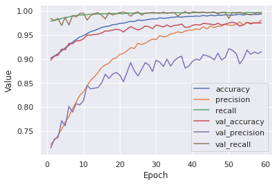

## 5. Results

### 5.1 Metrics

Metrics are an important aspect of machine learning because they provide an insight to the performance of the model. Therefore, it is important to think about the metrics that need to be used in order to properly judge a model's behavior and also allow the model to better improve its predictions. The metrics that were used in this project include root mean squared error, R^2 value, accuracy, precision, and recall.

#### 5.1.1 Root Mean Square Error

Root mean square error is a metric commonly used in statistics for measuring the difference between predicted and actual values for a set of data. It is calculated by taking the square root of the sum of the squares of the difference between the predicted and actual values. Because of the way it is calculated, the RMSE can never be negative. A lower RMSE is better, meaning that the predictions are closer to the actual values.

<em>Figure 5.1: Formula for RMSE [@TowardsDataScience]</em>

  
[@TowardsDataScience]: https://towardsdatascience.com/what-does-rmse-really-mean-806b65f2e48e
  
#### 5.1.2 R^2 Value

The R^2 value, also called the coefficient of determination, is a measure of how well a model is fit to the data. It gives an indication of how likely the model is to be able to predict a future value well based on the current data and outputs a number between 0 and 1, where higher numbers are desired. The R^2 calculation is based on the correlations between the independent variables and the correlations between the independent variables and the dependent variable. The equation can be found below in Figure 5.2. There, c is the vector containing the correlations between  the independent and the dependent variables, and R is the correlation matrix of the dependent variables.

<em>Figure 5.2: Formula for R^2 [@Wikipedia/Multiple_correlation]</em>

  
[@Wikipedia/Multiple_correlation]: https://wikimedia.org/api/rest_v1/media/math/render/svg/2543e0a46d792a8bb93c4789e5aa10a7a3693cbc

#### 5.1.3 Accuracy

Accuracy, as it is used in machine learning, is a measure of the fraction of datapoints correctly identified by the model over the total amount of datapoints. It is calculated by the formula seen in Figure 5.3. It is one of the most common metrics for determining the results of a statistical problem.
  

<em>Figure 5.3: Formula for Accuracy [@Lawtomated]</em>

  
[@Lawtomated]: https://lawtomated.com/wp-content/uploads/2019/10/Accuracy_2.png

#### 5.1.4 Precision

Precision is a measure of the fraction of datapoints identified correctly over the total amount of datapoints identified for a given problem. This shows how often datapoints are incorrectly identified by the model. It is calculated as given in Figure 5.4.

#### 5.1.5 Recall

Recall is the ratio of how many identified datapoints make up the total set of that category of data. Recall is the indicator of how well the model is finding all of the data being sought. It is calculated as given in Figure 5.4.

<em>Figure 5.4: Formulas for Precision and Recall [@Wikipedia/Precision_and_recall]</em>

[@Wikipedia/Precision_and_recall]: https://upload.wikimedia.org/wikipedia/commons/thumb/2/26/Precisionrecall.svg/350px-Precisionrecall.svg.png

### 5.2 Logistic Regression

Logistic regression proved to perform relatively well in this experiment, especially once the dataset was augmented with additional copies of the sparse data. First looking at the results before the dataset was changed, the model showed some unexpected results, as seen in Figure 5.5. The results of the validation set matched closely to the training set, however this did not mean that the model was working properly. The accuracy was very high, around 96%, while the precision and recall ended up very low, both around 20%. This was a symptom of the sparsity of the dataset, as mentioned previously in the report. In addition, the recall started out very high and plummeted to a low value, which is a very unexpected behavior for the model. The model was clearly unable to learn the difference between an undamaged vs damaged data point. This is evidence of the fact that precision and recall are much more important metrics than accuracy for our experiment with the given dataset. 

<em>Figure 5.5: Results of Logistic Regression Model Before Dataset Augmentation</em>

Once the dataset was augmented, the model produced a much improved result. As seen in Figure 5.6, the recall and precision are much improved from before. The recall was now 99%, and the precision went up to ~60%. The accuracy did suffer, now ~83%, however the model is much improved overall. The results showed that this model was correctly identifying almost all damaged datapoints, given the nearly perfect recall, and was incorrectly identifying a good amount of undamaged datapoints as damaged. This is not an ideal result but it is much better than missing damaged datapoints. 

<em>Figure 5.6: Results of Logistic Regression Model After Dataset Augmentation</em>

### 5.3 Polynomial Regression

Polynomial regression did not perform very well in this experiment. As seen in Figure 5.7, the low R^2 value of ~0.175 in the validation set showed that the predictions of the model were not very well correlated with the actual values. Once the dataset was augmented and rerun through the model, the R^2 value greatly increased to around 0.537. This result is shown in Figure 5.8. Although this result is still quite low, the improvement is very noticeable and shows that a more refined model using polynomial regression may be useful. The RMSE of each run can also be compared. The first run had a lower score of 0.167 in comparison to the 0.292 of the second run. This is not what was expected, since a better model should have both a lower RMSE and a higher R^2 value. This result may be explained by the predictions of the model in the second run being more well correlated but having a larger variance from the actual values. This could likely have been due to the fact that a much larger fraction of the data after augmentation was the damaged condition, which increased the variance of the dataset.
  

<em>Figure 5.7: Results of Polynomial Regression Model Before Dataset Augmentation</em>

<em>Figure 5.8: Results of Polynomial Regression Model After Dataset Augmentation</em>

### 5.4 Artificial Neural Network

The artificial neural network performed the best out of all the methods attempted. Using the original data, this model had a similar result to the logistic regression model, although with improved precision and recall of ~45% and ~60%, respectively. These results can be seen in Figure 5.9. 

<em>Figure 5.9: Results of Artificial Neural Network Model Before Dataset Augmentation</em>

After the dataset was augmented and the model re-ran it produced a fantastic result that was far better than the rest of the models that were used. The model now had an accuracy of about 98%, a precision of ~91%, and a nearly perfect recall of 99.8%. This can be seen in Figure 5.10. These results show that the issue of sparse data was the only issue preventing this model from performing very well. It should be noted that the validation set precision did deviate away from the training set precision, which was likely a limitation of how well the model was able to learn the particularities of the dataset, which resulted in some undamaged datapoints being falsely labeled as damaged. Nevertheless, the extremely high recall shows that almost all of the damaged datapoints were found correctly, which was far more important.

<em>Figure 5.10: Results of Artificial Neural Network Model After Dataset Augmentation</em>

### 5.5 Random Forest Regression

The random forest regression model can be most closely compared to the polynomial regression model. Before the dataset was augmented, this modal fared worse than the polynomial regression with an R^2 value of 0.092. The results are shown in Figure 5.11. It is seen that this model is a very poor fit for the type of dataset used in this project, since it did the worst out of the 4 models tried. After dataset augmentation, this model also vastly improved, up to an R^2 of 0.408, but was still not satisfactory. These results can be found in Figure 5.12. This model also shared the peculiar result of a higher RMSE after the augmented dataset was run and can be similarly explained.

<em>Figure 5.11: Results of Random Forest Regression Model Before Dataset Augmentation</em>

<em>Figure 5.12: Results of Random Forest Regression Model After Dataset Augmentation</em>

