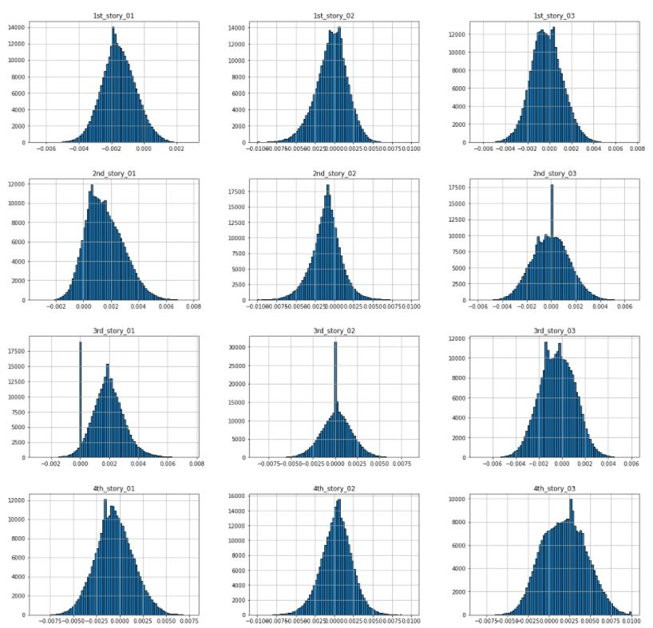
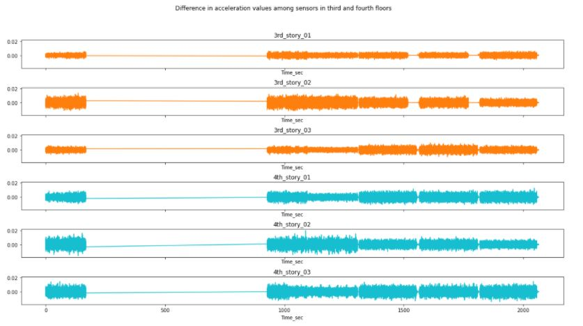
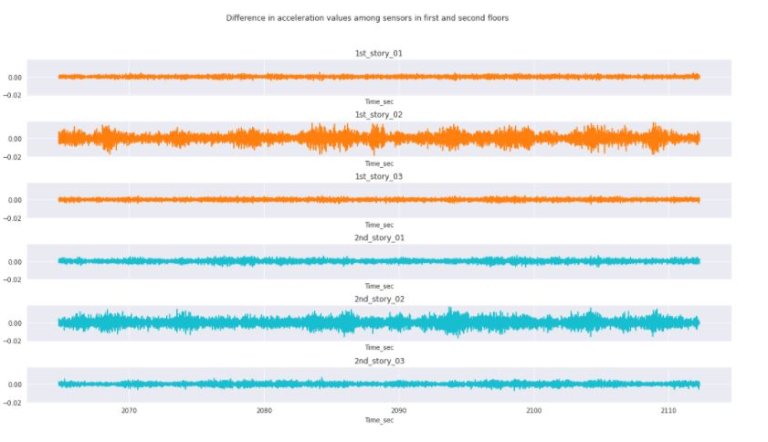
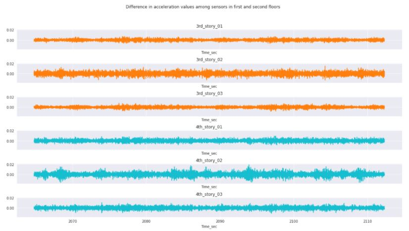
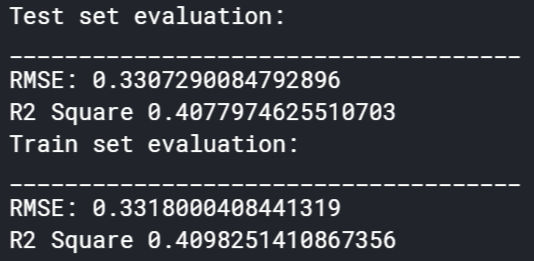

---
author-meta:
- David Budzik
- Claudia Mederos
- Bolaji Lawal
- Abdullah Assaf
bibliography:
- content/manual-references.json
date-meta: '2020-12-06'
header-includes: '<!--

  Manubot generated metadata rendered from header-includes-template.html.

  Suggest improvements at https://github.com/manubot/manubot/blob/master/manubot/process/header-includes-template.html

  -->

  <meta name="dc.format" content="text/html" />

  <meta name="dc.title" content="Project 9: Structural Health Monitoring" />

  <meta name="citation_title" content="Project 9: Structural Health Monitoring" />

  <meta property="og:title" content="Project 9: Structural Health Monitoring" />

  <meta property="twitter:title" content="Project 9: Structural Health Monitoring" />

  <meta name="dc.date" content="2020-12-06" />

  <meta name="citation_publication_date" content="2020-12-06" />

  <meta name="dc.language" content="en-US" />

  <meta name="citation_language" content="en-US" />

  <meta name="dc.relation.ispartof" content="Manubot" />

  <meta name="dc.publisher" content="Manubot" />

  <meta name="citation_journal_title" content="Manubot" />

  <meta name="citation_technical_report_institution" content="Manubot" />

  <meta name="citation_author" content="David Budzik" />

  <meta name="citation_author" content="Claudia Mederos" />

  <meta name="citation_author" content="Bolaji Lawal" />

  <meta name="citation_author" content="Abdullah Assaf" />

  <link rel="canonical" href="https://dbudzik.github.io/project9_SHM/" />

  <meta property="og:url" content="https://dbudzik.github.io/project9_SHM/" />

  <meta property="twitter:url" content="https://dbudzik.github.io/project9_SHM/" />

  <meta name="citation_fulltext_html_url" content="https://dbudzik.github.io/project9_SHM/" />

  <meta name="citation_pdf_url" content="https://dbudzik.github.io/project9_SHM/manuscript.pdf" />

  <link rel="alternate" type="application/pdf" href="https://dbudzik.github.io/project9_SHM/manuscript.pdf" />

  <link rel="alternate" type="text/html" href="https://dbudzik.github.io/project9_SHM/v/e1c2213e2a78649ad74ac03abc76adee8e2fbe4e/" />

  <meta name="manubot_html_url_versioned" content="https://dbudzik.github.io/project9_SHM/v/e1c2213e2a78649ad74ac03abc76adee8e2fbe4e/" />

  <meta name="manubot_pdf_url_versioned" content="https://dbudzik.github.io/project9_SHM/v/e1c2213e2a78649ad74ac03abc76adee8e2fbe4e/manuscript.pdf" />

  <meta property="og:type" content="article" />

  <meta property="twitter:card" content="summary_large_image" />

  <link rel="icon" type="image/png" sizes="192x192" href="https://manubot.org/favicon-192x192.png" />

  <link rel="mask-icon" href="https://manubot.org/safari-pinned-tab.svg" color="#ad1457" />

  <meta name="theme-color" content="#ad1457" />

  <!-- end Manubot generated metadata -->'
keywords:
- structural health monitoring
- civil infrastructure
- machine learning
- data science
- manubot
lang: en-US
manubot-clear-requests-cache: false
manubot-output-bibliography: output/references.json
manubot-output-citekeys: output/citations.tsv
manubot-requests-cache-path: ci/cache/requests-cache
title: 'Project 9: Structural Health Monitoring'
...

<small><em>
This manuscript
([permalink](https://dbudzik.github.io/project9_SHM/v/e1c2213e2a78649ad74ac03abc76adee8e2fbe4e/))
was automatically generated
from [dbudzik/project9_SHM@e1c2213](https://github.com/dbudzik/project9_SHM/tree/e1c2213e2a78649ad74ac03abc76adee8e2fbe4e)
on December 6, 2020.
</em></small>

## Authors

+ **David Budzik** 
    · {.inline_icon}
    [dbudzik](https://github.com/dbudzik) 
  <small>
  </small>

+ **Claudia Mederos** 
    · {.inline_icon}
    [cr25](https://github.com/cr25) 
  <small>
  </small>

+ **Bolaji Lawal** 
    · {.inline_icon}
    [bolajilawal](https://github.com/bolajilawal) 
  <small>
  </small>

+ **Abdullah Assaf** 
    · {.inline_icon}
    [aboo12](https://github.com/aboo12) 
  <small>
  </small>

## 1. Abstract {.page_break_before}
Civil infrastructure all around is subjected to the challenges posed by aging, deterioration, and extreme events. In recent years, structural health monitoring has grown in importance as failure and collapse of infrastructure result in harmful effects on a nation's economy and development. Recent advances as seen the use of sensors to obtain the dynamic characteristics of structures. This has led to the potential of collecting dynamic data at more frequent intervals thus leading to continuous monitoring. In this report, we use exploratory data analysis techniques to see if such dynamic data collected from structures can be used to infer the condition of a structure. We have also tried different machine learning algorithms to predict the condition of a structure based on given acceleration signals. For this study, the ASCE benchmark problem experimental phase II structure was used.

## 2. Introduction
	

### 2.1 Motivation behind the research experiment
Identification of damage from the analysis of vibration signals has received significant attention in the civil, mechanical and aerospace fields.
Structural health monitoring allows the engineer to use sensing of the structural responses in conjunction with appropriate analysis and modeling techniques, to monitor the condition of a structure. The problem most commonly considered is that where data is recorded at two different times and it is of interest to determine if the structure suffered damage in the time interval between the two observations. The behavior of the system during the observation periods is typically assumed linear and the damage is identified as changes in system parameters. A solution can be obtained in principle by using the measured data to optimize a model of the structure in the two states and inspecting the differences. 
The goal of the experiment was to develope an automated structural health monitoring system capable of providing early warnings against structural damage. In order to achieve this, damage was simulated by removing bracing within the structure in nine different ways as shown in the following sections.
	

### 2.2 Literature Review
Due to the importance of this research, there have been multiple papers regarding how to optimize the recollection of the data and quantity needed for training the machine learning algorithm. Examination of the literature reveals, however, that the assumptions used to establish the various approaches vary widely and it is unclear what is the true capability of the current state of the art in damage detection of civil engineering structures. 
	

#### 1-D CNNs for structural damage detection: Verification on a structural health monitoring benchmark data
Nowadays, a large number of measurement scenarios are needed to generate training data before placing the sensors in large civil structures. The paper “1-D CNNs for structural damage detection: Verification on a structural health monitoring benchmark data” provides an enhanced CNN-based algorithm which only requires two training sessions, ensuring accuracy and speed. 
The damage was estimated successfully by applying a CNN-based approach only requiring two measurement datasets. The overall structural health monitoring procedure for this paper took place on a very short amount of time, around 5000x faster than the conventional procedure. The authors indicated that this approach can be utilized on any structures, regardless of the size of the structure. Yet, the data processed was based exclusively on a monitored structure, and one may wonder how the fully damaged scenario data could be obtained on a large civil structure that needs to be monitored. Also, other difficulties become more apparent if we take into consideration how large civil structures do not behave precisely as the replica in which accelerometers were placed. It is almost impossible to repeat the measurement procedure that took place for the Phase II benchmark study on any other structure. And finally, although anomaly detection is obtained using CNNs algorithms, the cause of such anomaly or the location is completely a mystery. It is important to know the state of a structure for public safety, but it is also very important to locate the damage in order to take action. 
	
	
#### Sequential Multiple Structural Damage Detection and Localization: A Distributed Approach
The article focuses on a distributed approach to structural damage detection and localization that looks to address three main drawbacks in the structural damage detection process. The three drawbacks are damage being reported with short delay, damage locations have to identified simultaneously, and computational complexity is untraceable in large-scale wiles sensor networks. To address these problems the article attempts to introduce a new damage identification approach that focuses on time-series of damage sensitive features extracted from multiple sensors’ measurements and the optimal change point detection theory.

#### : Structural Health Monitoring of Cantilever Beam, A Case Study – Using Bayesian Neural Network and Deep Learning
This case study took a look at the use of machine learning models to predict damage to a cantilever beam. The beam in this study was modeled in a finite element analysis software and was subjected to dynamic loading in the software. The raw frequency response data from this analysis was the input for the machine learning algorithms. The study compared the accuracy of three algorithms: Bayesian Neural Network, Convolutional Neural Network, and Long Short Term Memory, to see which provides the best approximation for structural damage. The approach they took created the models based on the raw data, which is an advantage over traditional methods where data must be cleaned and prepped. This makes it more suitable for real-time monitoring, which is an important possible implementation. 

### 2.3 Structure & experiment descriptions:
	

**Benchmark Structure**
	

The benchmark structure is a 2-bay by 2-bay, 4 story steel frame structure at the University of British Columbia.

<em>Figure 2.1: Benchmark Structure</em>

Cases with known and unknown input and damage scenarios including symmetrical and unsymmetrical loss of stiffness in the bracing system were considered.  The experiment in question is regarding how damage can be simulated by removing bracing or loosening bolts within a four-story steel frame structure. Complete details of the damage cases, input excitation and other pertinent aspects of the study of phase I can be found below. To obtain the data, accelerometers were placed throughout the structure to provide measurements of the structural responses. In particular, three sensors per floor. One located at the center, one at the west side and one at the east side, as the MATLAB files indicate. Then, different cases took place in which members were loosen or removed to analyze the output and correlate the difference in acceleration values with the difference in setup.
	 
**The different cases**

* Case 1 - Fully braced configuration.
* Case 2 - All east side braces removed.
* Case 3 - Removed braces on all floors in one bay on southeast corner.
* Case 4 - Removed braces on 1st and 4th floors in one bay on southeast corner.
* Case 5 - Removed braces on 1st floor in one bay on southeast corner.
* Case 6 - Removed braces on all floors on east face, and 2nd floor braces on north faces.
* Case 7 - All braces removed on all faces.
* Case 8 - Configuration 7 + loosened bolts on all floors at both ends of beam on east face, north side.
* Case 9 - Configuration 7 + loosened bolts on floors 1 and 2 at both ends of beam on east face, north side.
	

<em>Figure 2.2: Cases 2-5 </em>

	

<em>Figure 2.3: Cases 6-8</em>

	
**Force Input**

Ambient vibration was inputted into the structure by two types of forced excitations. The forced exci- tation cases consider both impact hammer tests, and broadband excitations provided by an electrodynamic shaker. 
The choice of these two methods is to simulate the structure's response during an earthquake.
	

### 2.4 Motivation behind the project on structural damage detection
Numerous structural health monitoring algorithms have been developed and been implemented on experimental and full-scale structure.Because the techniques are applied to different structures under various conditions, the relative merits of each algorithm are not obvious. Thus, the community would benefit from a comparison of several algorithms when applied to the same problems.

# 3. Exploratory Data Analysis

The goal of this EDA is to identify characteristics between damage and undamage conditions in order to perform data preparation and develop a model in the future steps.

## 3.1 Preparing the data

<em>Figure 3.1: Checking if the data is sorted logically as undamage becoming damag.</em>

As the dataset shows, we have damage within our data. Therefore, Case 1 is not represented in train data.

<em>Figure 3.2: Analyzing the training data provided.</em>

The reason that there are accelerations values at the first row is because researchers started measuring the structure's response once it reached steady state. More details regarding the dynamic behavior of this structure will be discussed in the following sections.

**Separating train data into damage and undamage dataset**

<em>Figure 3.3: Missing data in the undamaged section.</em>

*As shown above, the given data set contained a large quantity of NA data values which are all located in the undamaged portion.*

Between populating or removing the missing data, the missing results will be dropped. The reason for this decision is because populating the missing values with the mean of the training data will mostly develope a new dataset that does not have all the original parameters. 

**Aesthetic modifitication for easier comprehension of the training data**

The provided trainign dataframe had columns names such as DA04, which corresponds to the sensor located in the first flor west side. Instead of keeping these columns names, the datasets were named as shown below.

<em>Figure 3.4: Column Names.</em>

**Units**

Based on *Experimental Phase II of the Structural Health Monitoring Benchmark Problem* , accelerometers were placed throughout the structure to provide measurements of the structural response. For this Exploratory Data Analysis, three sensors from each floor of the 4-story structure were taken into consideration. Specifically,

Sensor 01 = Sensor located at the west side of the structure. 

Sensor 02 = Sensor located at the center of the structure.

Sensor 03 = Sensor located at the east side of the structure.

$Units = \frac{m}{s^2}$ 

- In the original data from the researchers, time is describe as,
$Time(seconds) = \frac{1 : Length_{DA04}}{fs_{days}}$ 

where fsdasy = 200 (Hz).

Therefore, the final step on the tyding portion of the exploratory data analysis was to transform the "Time" column into seconds by divided by 200.

## 3.2 Statistical Properties

We can learn certain details of the response of the structure by observing the data points that have a very drastic charnge in amplitude. In other words, there are common points in time among all sensors where the acceleration measured does a 180 degrees change. This phenomenon occurs as the dynamics response of structure is harmonic and it develops nodes. A simplification of this idea is to understand how the sensors in the 4th story will move back and forward while nodes underneath are ahead or behind that displacement.

<em>Figure 3.5: Visualization of the overall data.</em>

The mean for all the sensors is very close to 0, which may indicate normalized normal distribution. Also, the standard deviation is not equal to 1 for any of the sensors, but a close value to 0 too. These characteristics are present for normal distributions of narrow dispersion.

In the case of undamaged dataset, the standard deviation values of the fourth floor are the largest among all floors. This indicates a flexibility in the structure as the dynamic response took place. Another very interesting fact that we can learn from the previous tables is how the maximum value of 0.01 takes place at two sensor in the 4 story, and the sensor located at the center for the 1st and 2nd floor. The absence of this value at the 3rd floor may indicate an anomaly. This value stays constant after the structure is considered damaged for the sensors located at the center of the second and fourth floor.

**Checking head, tail of data**

<em>Figure 3.6: Histogram of undamaged acceleration values at each sensor..</em>

In the case of the undamaged dataset, all the graphs show normal distribution. However, they are not centered with an exact mean of value 0. Instead,

- Sensors located at the west side of the structure are skewed to the right in the first and fourth floor while the second and third floor are skewed to the left.
- Sensors located at the center of the structure behave symmetrically. The first and third floor have bell-shaped distribution with a mean of 0. The second and fourth floor are lightly skewed in opposite directions.
- Sensors located at the east side of the structure are all skewed except the one located at the second floor. The sensor at the 4th floor captured the most out of plane behavior as the '4th_story_03' sensor is significatly skewed to the left.

<em>Figure 3.7: Histogram of damaged acceleration values at each sensor.</em>

For the case of damage condition, the normal distribution is not as smooth as shown for the undamaged condition. This behavior matches with the physical phenomenon that took place as the acceleration of the sensors will tend to be more extreme if the structure is damaged. 

- The first floor endured the most extreme values as the base is not static anymore during excitation. The three sensors are skewed to the right.
- The second and third floor has similar behavior since the center sensor is still normally distributed with mean very close to 0 and sensors on the west and east side are skewed to the left.
- The fourth floor now shows the most ccentered behavior. However, it is importqant to recall the statistical characteristics such as standard deviation. Now the 4th-floor values are significantly wider.

## 3.3 Exploring the dataframe that contains the undamaged condition**

Previously, we explored some characteristics of the undamaged dataset. Then, the dataset has been arranged and tidied to finally observe how there was a large amoung of non-available data points, which can be observed in the last row (index number > time_sec)

**Is the change in acceleration always the same?**

For the following inspection, recall that data acquisition was started several seconds after the excitation was turned on to ensure that the system had reached a steady state condition during the shaker testing.

<em>Figure 3.8: Changes in acceleration during the undamaged condition for the first and second floor.</em>

<em>Figure 3.9: Changes in acceleration during the undamaged condition for the third and fourth.</em>

Interestingly, the analysis has shown how the location of the sensor affects directly to the change in acceleration of the sensors. The y-axis has been kept constant throughout all the plots to ease comparison. Therefore, we can observe how though the distribution among sensors in different floor is different, the difference in acceleration values is very correlated to location.

Also note how the missing data produced zero values in the left portion of the data. Those values are not representing a constant acceleration.

**Correlation values**

<em>Figure 3.10: Correlation values among all sensors in the undamaged condition.</em>

The table above is with the purpose of locating the directly correlated and inversevely correlated sensors. Just as the difference in acceleration graphs showed, there is significant correlation between those sensors that are located in the same side of the structure. 

However, there is an inverse correlation in those sensors loccated at the fourth floor. The reason behind this behavior is that we are analyzing an elastic structure that is being excited by an harmonic input from the ground. Therefore, the top floor is swinging, which creates a driving behavior in one of the corners at a time.

## 3.4 Exploring the dataframe that contains the undamaged condition**

**Is the change in acceleration always the same?**

<em>Figure 3.11: Change in acceleration between sensors in the damaged condition for the 1st and 2nd floor.</em>

<em>Figure 3.12: Change in acceleration between sensors in the damaged condition for the 3rd and 4th floor.</em>

There are certain conditions that we can observe by comparing the undamaged and damaged conditions. First of all, there is still a correlation in the change in acceleration with the location of the sensors. Also, the delta value has been significantly decreased over the length of the response. The largest change in acceleration is located at the center sensors for this particular condition, which might mean that the structure is not displacing as much once it reaches a damaged condition.

**Correlation values**

<em>Figure 3.13: Correltion value among all sensors for the damaged condition.</em>

In this scenario, the correlation has changed greatly. Now, the 4th-story sensors display similarities with other sensors placed in the same side of the structure. However, the 3rd-story sensors are those that are inversely correlated. 

## 3.5 Conclussion

The training data obtained has been statistically explored, cleaned, and analyzed for the purpose of identifying parameters for modeling later on.

- Missing data has been removed.
- Datatype and Data Info has been discussed and visually listed.
- The distribution for the undamaged and damaged conditions proved to be normally distributed with skewness at different direction based on the sensors. This analysis portion showed how the skewness was correlated with the behavior that was taking place during excitation as the dynamic response of a steel frame structure is not rigid. Also, once the damaged condition was achieved, the distribution showed a larger standard deviation.
- The individual analysis of each condition proved to be succesful in correlating the behavior of each sensor among stories. 
    - The change in acceleration depended directly with the location on the sensor within the steel frame structure. 
    - There was a high correlation between sensors located at different floors that were place on the same side.    
- Due to the high symmetry among all the results and comparisons, it is probable that the training data belonged to Case 6, Case 7 or Case 8. However, the final information indicated how the 3rd story behaved differently, which potentially indicated that the training data has a higher probably of being Case 8.

## Machine Learning Methods

## 4. Overview
Following a comprehensive exploratory data analysis as outlined in the previous section, which was valuable in looking at different patterns and features of the data obtained from various sensors. The next task then, was to classify this data as either damaged or undamaged. Classification problems are very common in the data mining and machine learning applications. As such, several machine learning algorithms have been proposed and developed over the years for solving such problems. For our project, we have evaluated and tested five of those algorithms namely, Logistic regression, polynomial regression, artificial neural networks, recurrent neural networks and random forests.
## 4.1 Explanation of the Problem:
Our Kaggle Project was focused on Binary classification. Binary Classification is the task of classifying the elements of a set into two groups on the basis of a classification rule. Our problem revolved around classifying the structural damage detected in a structure. We had to choose different machine learning algorithms to help classify the data.

## 4.2 Steps For each algorithm:
First we had to create a model, softmax or sigmoid used in output layer, so that we could train the model and tune hyperparameters, such as accuracy, precision etc. Finally, we had to test the performance of model against the sample data. This allowed us to compare results from different models and see what model was the most accurate at classifying the data.

## 4.3 Data Preparation:
First we had to split the train dataset into 2, one set for training and the other for validation. Then we had to shuffle the train dataset before using it. We then used regularizations to apply penalties on layer parameters or layer activity during optimization. Dropouts were used to incorporate non-linearity. The data was normalized by subtracting the mean and dividing by standard deviation.

## 4.4 Method 1: Logistic Regression:
Logistic regression is a technique commonly typically used for predicting binary classes but can also be used for multi-class problems and is adopted from the field of statistics. It describes and estimates the relationship between one dependent variable and the independent variables. Logistic regression is a special case of linear regression that produces a constant output which is categorical in nature. Thus it is based on the linear regression equation:

<em>Figure 4.1: logistic_regression (sigmoid_activation_function)</em>

### 4.4.1 Justification for Logistic Regression:
 The (sometimes surprising) observation is that this is still a linear mo
Logistic regression is one of the most simple machine learning algorithms that can be used for binary classification problems. It is easy to implement and can be used as a baseline for any binary classification problem. As such, we decided to use it as a baseline to which all the other models will be compared with. It can also be built upon for developing more complex machine learning algorithms for deep learning. It computes a probability ouptut and in order to map this output to a binary category we needed to define a classification threshold (also known as the decision threshold). However, a linear regression does not necessarily yield an output betwewn 0 and 1. Therefore,to ensure the output probability is always between 0 and 1 we used a sigmoid activation function in the output layer. Different combinations of hyperparameters were tested for this algorithm, however to save computation time an epoch value of 20 was used with a learning rate of 0.001. A classification threshold of 0.2 was also found to work best for the given dataset. Although logistic regression is sensitive to outliers and multicorrelation between the features, our exploratory data analysis showed we do not have this problem for our given dataset. Therefore, we expect to achieve reasonable results using this method.

<em>Figure 4.2: overview_of_logistic_regression_model</em>
  
## 4.5 Method 2: Polynomial Regression:
  One common pattern within machine learning is to use linear models trained on nonlinear functions of the data. This approach maintains the generally fast performance of linear methods, while allowing them to fit a much wider range of data.

For example, a simple linear regression can be extended by constructing polynomial features from the coefficients. In the standard linear regression case, the model is based on the expression previously shown above. If we want to fit a paraboloid to the data instead of a plane, we can combine the features in second-order polynomials, so that the model looks like this:

del: to see this, imagine creating a new variable
 
 
 
 With this re-labeling of the data, our problem can be written as:
 
 
 
 ### 4.5.1 Justification for Polynomial Regression:
 Sometimes the relationship between the dependent and independent variables maybe non-linear. As in this case, we do not expect a linear relationship between the features and the target variable, it made sense to try a non-linear algorithm. The simplest and most common non-linear method to use is the polynomial regression as described earlier. Intuitively, we would expect a regression model with higher orders to perform better than a simple one. However, we didn't find significant improvements between 2nd degree and higher order polynomials. Therefore, for this project we chose to use 2nd degree polynomial regression models to help save computation time.
 
 
 

<em>Figure 4.3: overview_of_polynomial_regression_model</em>
 
## 4.6 Method 3: Artificial Neural Networks:
The second method utilized was Artificial Neural Networks. Artificial Neural Networks are more complex than logistic regression. This method adds a bunch of hidden non-linear layers to the logistic regression model. Our group used this method to check if it offered an improvement on the previous model. The artificial neural networks yeiled average results with great accuracy ~96%, Improved precision ~45%, Improved recall ~60%, although the metrics were not good overall. The model is shown in figure 4.4. 

 

<em>Figure 4.4: visualization_artificial_neural_networks</em>

## 4.7 Method 4: Recurrent Neural Networks:
Recurrent neural networks (RNNs) are a very powerful tool, however they suffer from the vanishing gradient problem. In order to avoid this issue, we have used a better variation of RNNs called Long Short Term Networks (LSTM) for this project. This basically consists of cells that are responsible for "remembering" values over a time interval. This differs from the traditional neural netwok in that not only does it learn from the features, but it also takes care of sequence values over time. That is, for traditional neural networks it is assumed that all inputs and outputs are independent of each other. However, for RNNs the output depends on the previous computation. As a result of this, RNNs are very popular for sequential data such as time series because they perform much deeper understanding of sequence when compared with other algorithms. They are also applicable to any data that can be rearranged to resemble sequential data. In terms of visualization, one can think of RNN models as shown below:

 

<em>Figure 4.5: visualization_of_recurrent_neural_network_models</em>

### 4.7.1 Justification for recurrent neural network:
Since, the index for our dataset actually represents time, then perhaps we can consider it as a time series data. As such, we decided to see how RNNs will perform in comparison with the other models. As was mentioned earlier, we used LSTM for this project. This type of model requires a 3-dimensional input, therefore we had to transform the shape of the dataset we had to make use of this model. In order to save computation time, a LSTM of 40 units was found to give the best performance and therefore used for testing the model. Additionally, a sigmoid activation function was applied in the outer layer. The hyperparameters were the same as with other models to ensure a fair coomparison between the different algorithms used.

<em>Figure 4.6: overview_of_recurrent_neural_network_model</em>

## 4.8 Method 5: Random Forest Regression:
The third method utilized was Random Forest Regression. Random Forest Regression performs both regression and classification tasks with the use of multiple decision trees and bagging. It is easy to use and often returns good results even without hyperparameter tuning. Our group used this method to check if it offered an improvement on the previous model. The Random Forest Regression provided the worst results with extremely inaccurate accuracy rate, while also not working well for the type of data we had. The model is shown below in figure 4.5. 

<em>Figure 4.7: Visualization_of_Random_Forest_Regression_models</em>

## 4.9 Issue:
We noticed that the problem was the precision and recall are very low even though accuracy is high. This was caused by the damaged data being too sparse, only 3.5% of our data represents the damaged condition. The solution was too add copies of the damaged data into the training set.

## 4.10 Take Two:
In take two we ran logistic regression and artifical nueral networks again to see if it yeilded better results with addiiton of new copies of damaged data. Logistic Regression returned good accuracy ~83%, much better precision ~60%, and Fantastic recall ~99%. Artifical Neural Network returned slighly better data with a fantastic accuracy ~98%, fantastic precision ~91%, and fantastic recall ~99%. the results are shown in figure 4.6 and 4.7. 

<em>Figure 4.8: Test_2_Logistic_Regression_models</em>
 
 

<em>Figure 4.9: Test_2_Artificial_Neural_Networks</em>

## 5. Results

### 5.1 Metrics

Metrics are an important aspect of machine learning because they provide an insight to the performance of the model. Therefore, it is important to think about the metrics that need to be used in order to properly judge a model's behavior and also allow the model to better improve its predictions. The metrics that were used in this project include root mean squared error, R^2 value, accuracy, precision, and recall.

#### 5.1.1 Root Mean Square Error

Root mean square error is a metric commonly used in statistics for measuring the difference between predicted and actual values for a set of data. It is calculated by taking the square root of the sum of the squares of the difference between the predicted and actual values. Because of the way it is calculated, the RMSE can never be negative. A lower RMSE is better, meaning that the predictions are closer to the actual values.

<em>Figure 5.1: Formula for RMSE [@TowardsDataScience]</em>

  
[@TowardsDataScience]: https://towardsdatascience.com/what-does-rmse-really-mean-806b65f2e48e
  
#### 5.1.2 R^2 Value

The R^2 value, also called the coefficient of determination, is a measure of how well a model is fit to the data. It gives an indication of how likely the model is to be able to predict a future value well based on the current data and outputs a number between 0 and 1, where higher numbers are desired. The R^2 calculation is based on the correlations between the independent variables and the correlations between the independent variables and the dependent variable. The equation can be found below in Figure 5.2. There, c is the vector containing the correlations between  the independent and the dependent variables, and R is the correlation matrix of the dependent variables.

<em>Figure 5.2: Formula for R^2 [@Wikipedia/Multiple_correlation]</em>

  
[@Wikipedia/Multiple_correlation]: https://wikimedia.org/api/rest_v1/media/math/render/svg/2543e0a46d792a8bb93c4789e5aa10a7a3693cbc

#### 5.1.3 Accuracy

Accuracy, as it is used in machine learning, is a measure of the fraction of datapoints correctly identified by the model over the total amount of datapoints. It is calculated by the formula seen in Figure 5.3. It is one of the most common metrics for determining the results of a statistical problem.
  

<em>Figure 5.3: Formula for Accuracy [@Lawtomated]</em>

  
[@Lawtomated]: https://lawtomated.com/wp-content/uploads/2019/10/Accuracy_2.png

#### 5.1.4 Precision

Precision is a measure of the fraction of datapoints identified correctly over the total amount of datapoints identified for a given problem. This shows how often datapoints are incorrectly identified by the model. It is calculated as given in Figure 5.4.

#### 5.1.5 Recall

Recall is the ratio of how many identified datapoints make up the total set of that category of data. Recall is the indicator of how well the model is finding all of the data being sought. It is calculated as given in Figure 5.4.

<em>Figure 5.4: Formulas for Precision and Recall [@Wikipedia/Precision_and_recall]</em>

[@Wikipedia/Precision_and_recall]: https://upload.wikimedia.org/wikipedia/commons/thumb/2/26/Precisionrecall.svg/350px-Precisionrecall.svg.png

### 5.2 Logistic Regression

Logistic regression proved to perform relatively well in this experiment, especially once the dataset was augmented with additional copies of the sparse data. First looking at the results before the dataset was changed, the model showed some unexpected results, as seen in Figure 5.5. The results of the validation set matched closely to the training set, however this did not mean that the model was working properly. The accuracy was very high, around 96%, while the precision and recall ended up very low, both around 20%. This was a symptom of the sparsity of the dataset, as mentioned previously in the report. In addition, the recall started out very high and plummeted to a low value, which is a very unexpected behavior for the model. The model was clearly unable to learn the difference between an undamaged vs damaged data point. This is evidence of the fact that precision and recall are much more important metrics than accuracy for our experiment with the given dataset. 

<em>Figure 5.5: Results of Logistic Regression Model Before Dataset Augmentation</em>

Once the dataset was augmented, the model produced a much improved result. As seen in Figure 5.6, the recall and precision are much improved from before. The recall was now 99%, and the precision went up to ~60%. The accuracy did suffer, now ~83%, however the model is much improved overall. The results showed that this model was correctly identifying almost all damaged datapoints, given the nearly perfect recall, and was incorrectly identifying a good amount of undamaged datapoints as damaged. This is not an ideal result but it is much better than missing damaged datapoints. 

<em>Figure 5.6: Results of Logistic Regression Model After Dataset Augmentation</em>

### 5.3 Polynomial Regression

Polynomial regression did not perform very well in this experiment. As seen in Figure 5.7, the low R^2 value of ~0.175 in the validation set showed that the predictions of the model were not very well correlated with the actual values. Once the dataset was augmented and rerun through the model, the R^2 value greatly increased to around 0.537. This result is shown in Figure 5.8. Although this result is still quite low, the improvement is very noticeable and shows that a more refined model using polynomial regression may be useful. The RMSE of each run can also be compared. The first run had a lower score of 0.167 in comparison to the 0.292 of the second run. This is not what was expected, since a better model should have both a lower RMSE and a higher R^2 value. This result may be explained by the predictions of the model in the second run being more well correlated but having a larger variance from the actual values. This could likely have been due to the fact that a much larger fraction of the data after augmentation was the damaged condition, which increased the variance of the dataset.
  

<em>Figure 5.7: Results of Polynomial Regression Model Before Dataset Augmentation</em>

<em>Figure 5.8: Results of Polynomial Regression Model After Dataset Augmentation</em>

### 5.4 Artificial Neural Network

The artificial neural network performed the best out of all the methods attempted. Using the original data, this model had a similar result to the logistic regression model, although with improved precision and recall of ~45% and ~60%, respectively. These results can be seen in Figure 5.9. 

<em>Figure 5.9: Results of Artificial Neural Network Model Before Dataset Augmentation</em>

After the dataset was augmented and the model re-ran it produced a fantastic result that was far better than the rest of the models that were used. The model now had an accuracy of about 98%, a precision of ~91%, and a nearly perfect recall of 99.8%. This can be seen in Figure 5.10. These results show that the issue of sparse data was the only issue preventing this model from performing very well. It should be noted that the validation set precision did deviate away from the training set precision, which was likely a limitation of how well the model was able to learn the particularities of the dataset, which resulted in some undamaged datapoints being falsely labeled as damaged. Nevertheless, the extremely high recall shows that almost all of the damaged datapoints were found correctly, which was far more important.

<em>Figure 5.10: Results of Artificial Neural Network Model After Dataset Augmentation</em>

  
### 5.5 Recurrent Neural Network  

The recurrent neural network model performed in a similar manner to the logistic regression and artificial neural network models. Before data augmentation, the model resulted in high accuracy but lower precision and recall, 20% and 34%, respectively. This is in line with the results of the other two mentioned models. The results are seen in Figure 5.11. After data augmentation, the accuracy suffered, going down to ~86%, but the precision increased to 62% and the recall to 98%. These results are on par with the logistic regression model, but now are far below what the artificial neural network was able to accomplish. Figure 5.12 shows these results.

<em>Figure 5.11: Results of Recurrent Neural Network Model Before Dataset Augmentation</em>

 

<em>Figure 5.12: Results of Recurrent Neural Network Model After Dataset Augmentation</em>

 

### 5.6 Random Forest Regression

The random forest regression model can be most closely compared to the polynomial regression model. Before the dataset was augmented, this modal fared worse than the polynomial regression with an R^2 value of 0.092. The results are shown in Figure 5.13. It is seen that this model is a very poor fit for the type of dataset used in this project, since it did the worst out of the 4 models tried. After dataset augmentation, this model also vastly improved, up to an R^2 of 0.408, but was still not satisfactory. These results can be found in Figure 5.14. This model also shared the peculiar result of a higher RMSE after the augmented dataset was run and can be similarly explained.

<em>Figure 5.13: Results of Random Forest Regression Model Before Dataset Augmentation</em>

<em>Figure 5.14: Results of Random Forest Regression Model After Dataset Augmentation</em>

## 6. Discussion

### 6.1 Key Takeaways

The first takeaway from the results of this project is that artificial neural networks are the best option for binary classification problems like this project. This is not surprising, given the popularity of ANNs. They are one of the most widely applied and useful machine learning algorithms and are able to take on most, if not all, machine learning problems and give a great result.

The second takeaway is that datasets such as ours that have very sparse data may result in poor learning of the model. In our case, the dataset had barely any damaged datapoints in comparison to undamaged, so the model was not able to learn how to identify between the two. Our solution to this was to add copies of the damaged data that we did have in order to allow the model to see them more. This is dangerous, however, because this does run the possibility of overfitting to those specific datapoints. Therefore, there is a limit to how many copies should be included in the dataset to avoid these issues.

### 6.2 Applications

The results of this project show that machine learning has a place in structural health monitoring. A team with more machine learning experience and more data can create a model that can determine structural damage in real time and thus may be able to prevent or predict a structural collapse and save lives. The idea can be taken even further and can be adapted and expanded to allow for detection of damage in specific regions or even specific structural members in the structure, as well as predicting useful structural life. This can save large amounts of money that are spent on structural inspections, repairs, and rebuilding after catastrophic failures.

## Conclusion

Conclusion goes here

## References {.page_break_before}

<!-- Explicitly insert bibliography here -->

